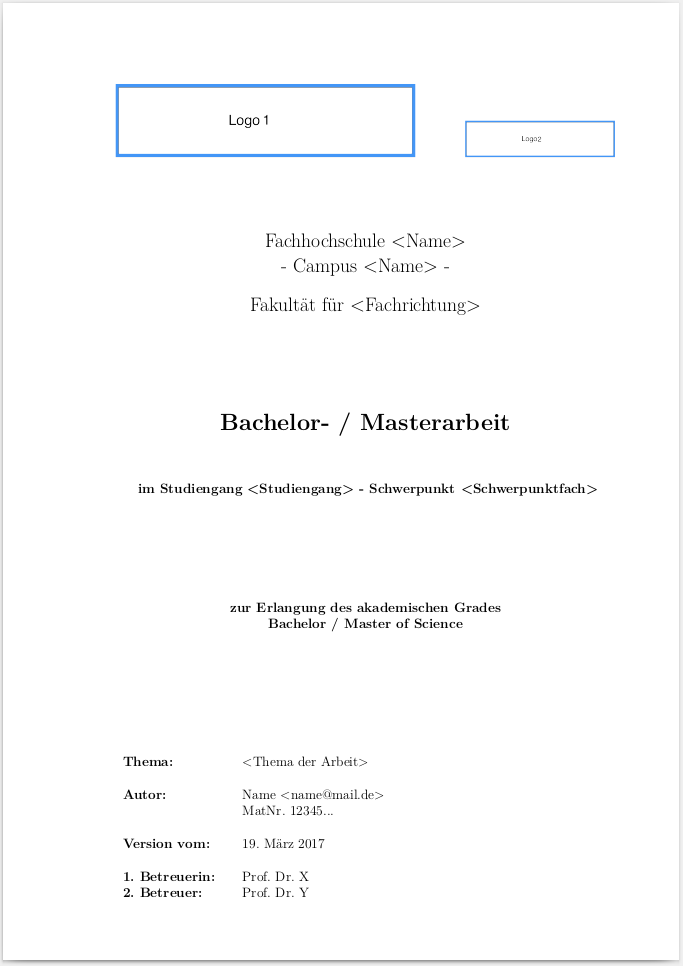

# latex-modello-diplom-bachelor-masterthesi

Questo modello LaTeX può essere utilizzato per relazioni tecniche, tesi di laurea o di laurea magistrale. Si prega di vedere "[Hauptdatei.pdf](../../src/Hauptdatei.pdf)" come esempio.

## Uso

Il file principale del template è il "[Hauptdatei.tex](../../src/Hauptdatei.tex)". Qui vengono impostate le impostazioni di base del layout e gli altri file sono inclusi. È possibile estendere questi file per il proprio lavoro. I suggerimenti per le direttive LaTeX si trovano direttamente nel codice sorgente del template.

Il "[example.tex](../../src/example.tex)" mostra come immagini, riferimenti di immagini, tabelle, elenchi di codici sorgente, formule matematiche e note a piè di pagina possono essere utilizzati in LaTeX.

Inoltre troverete diversi segnaposto per i loghi della vostra università/università, il vostro nome, i professori, il numero di matricola ecc.

Il modello utilizza le citazioni della letteratura tedesca nella bibliografia secondo la norma tedesca DIN 1505, parte 2 del gennaio 1984 (vedi [alphadin.bst](../../src/alphadin.bst)). Si prega di verificare se questo stile di citazione è accettato dal vostro istituto, come di solito accade per una tesi in lingua tedesca.

## Codifica dei caratteri

Il modello utilizza il set di caratteri generalmente consigliato UTF-8, in modo da poter utilizzare direttamente le umlauts tedesche ÄäÖööööÜü e le virgolette „“ nel codice sorgente.

## Da LaTeX a PDF

Sotto "[scripts/generatePdf.sh](../../scripts/generatePdf.sh)" si trova lo script che spesso può essere usato direttamente su sistemi operativi unix-like (Linux, Mac) dopo l'installazione di una distribuzione TEX. Utilizzando pdflatex, bibtex e makeindex viene generato direttamente dal template un PDF con la bibliografia e l'elenco delle abbreviazioni.

## Distribuzioni ed editor di LaTeX

Probabilmente utilizzerete un editor con supporto LaTeX per scrivere il vostro lavoro.

### Linux: Debian, Ubuntu, Linux Mint

Per le distribuzioni Linux basate su Debian raccomando la distribuzione TEX [TeX Live](http://www.tug.org/texlive/ "TeX Live") e l'editor [Kile](http://kile.sourceforge.net/ "Kile").

I seguenti link vi aiuteranno ad installare il software sotto Ubuntu:
[Installazione di TeX Live](http://wiki.ubuntuusers.de/LATEX#TeX-Live "Installazione di TeX Live").
[Installazione di Kile](http://wiki.ubuntuusers.de/Kile "Installazione di Kile").

### Mac

Sul Mac, una combinazione della distribuzione [MacTeX](http://www.tug.org/mactex/ "MacTeX") e dell'editor [TeXShop](http://pages.uoregon.edu/koch/texshop/ "TeXShop") si è rivelata molto utile. Una funzione utile con questa combinazione: Con CMD + click sinistro su un posto nel PDF si passa direttamente al posto corrispondente nel codice sorgente LaTeX nell'editor.

### Windows

Sotto Windows ho usato personalmente [TeXlipse](http://texlipse.sourceforge.net/ "TeXlipse") (Eclipse Plugin per LaTeX) e il [TeXnicCenter](http://www.texniccenter.org/ "TeXnicCenter") come editor. Come distribuzione [MikTeX](http://miktex.org/ "MikTeX") può essere utilizzato.

### Docker

L'ambiente per la creazione di file pdf può essere eseguito in un contenitore Docker. Per questo compito, si può usare il fornito [Dockerfile](../../Dockerfile).

L'immagine Docker può essere creata con il comando `docker build -t maknesium/latexvorlage:latest`. Poi, il contenitore può essere creato con il comando `docker run -d --nome latexvorlage-container -v /pfad/zum/ordner/src:/app/src maknesium/latexvorlage:latest`. Il contenitore non viene cancellato dopo che ha finito di compilare i file di testo e può essere semplicemente riavviato per compilare di nuovo i file di testo con il comando `docker start latexvorlage-container`.

### Estensione del laboratorio LaTeX per Visual Studio Code

Quando si usa LaTeX Workshop Extension per Visual Studio Code come editor, la directory delle abbreviazioni potrebbe non essere visualizzata correttamente.

In questo caso devi passare alla directory `/src` una volta sulla linea di comando ed eseguire il comando `makeindex mainfile.nlo -s ./latex_settings/abbreviations/nomencl.ist -o mainfile.nls`. L'elenco delle abbreviazioni sarà quindi visualizzato correttamente.

## Feedback

Se trovate commenti, suggerimenti per migliorare e/o errori, inviatemi un messaggio:
contatto al maknesium de

In alternativa, accetterò volentieri richieste di pull su Github.

Vi auguro tanto successo e divertimento mentre scrivete la vostra tesi con LaTeX!

# License

Questo lavoro è concesso in licenza sotto una licenza Creative Commons Attribution-NonCommercial-ShareAlike 3.0 Germany.
http://creativecommons.org/licenses/by-nc-sa/3.0/de/

# Offrimi un caffè!

Se il modello in lattice ti ha fatto risparmiare (molto) tempo, hai finalmente consegnato la tua tesi e ora vuoi solo restituire qualcosa, sei il benvenuto ad invitarmi per un caffè (o due). Sì, mi piace il caffè :)

